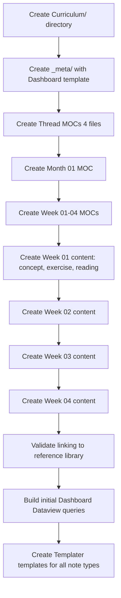

# Architecture Patterns

**Domain:** Obsidian-based 12-month progressive critical thinking curriculum for researchers
**Researched:** 2026-06-14
**Mode:** Ecosystem

## Recommended Architecture

### Vault Map (After Curriculum Addition)

```
Critical Thinking.md  ← Hub (unchanged, but add Curriculum link)
│
├── Biases/                    ← STAYS UNCHANGED (reference library)
├── Books/                     ← STAYS UNCHANGED
├── Claim Analysis/            ← STAYS UNCHANGED
├── Forecasts/                 ← STAYS UNCHANGED
├── Logical Fallacies/          ← STAYS UNCHANGED
├── Mental Models/              ← STAYS UNCHANGED
├── Paper Reviews/              ← STAYS UNCHANGED
├── Thinking Journal/           ← STAYS UNCHANGED
├── _templates/                 ← ADD curriculum templates here
│   ├── Claim.md               ← (existing)
│   ├── Forecast.md            ← (existing)
│   ├── Curriculum Weekly Note.md  ← NEW
│   ├── Curriculum Exercise.md     ← NEW
│   ├── Curriculum Self-Assessment.md ← NEW
│   └── Curriculum Paper Critique.md ← NEW
│
└── Curriculum/                 ← NEW — entire curriculum lives here
    ├── Curriculum Hub.md       ← Top-level entry point
    ├── _meta/                  ← System files for the curriculum
    │   ├── Dashboard.md        ← Dataview progress overview
    │   ├── Thread Index.md     ← Mapping of threads across months
    │   └── Curriculum Map.canvas ← Optional canvas overview
    │
    ├── Threads/                ← Cross-month thread notes (spiral)
    │   ├── Logic & Reasoning.md
    │   ├── Probability & Statistics.md
    │   ├── Scientific Reasoning.md
    │   └── Metacognition & Calibration.md
    │
    ├── Month 01 - Foundations/
    │   ├── Month 01 MOC.md
    │   ├── Week 01/
    │   │   ├── Week 01 MOC.md
    │   │   ├── Exercises/
    │   │   └── Resources/
    │   ├── Week 02/
    │   ├── Week 03/
    │   └── Week 04/
    │
    ├── Month 02 - Formal Tools/
    │   ├── Month 02 MOC.md
    │   └── ...
    │
    ├── ...
    │
    └── Month 12 - Integration/
        ├── Month 12 MOC.md
        └── ...
```

### Guiding Design Principles

1. **Curriculum is additive, not transformative** — the existing eight sections (`Biases/`, `Books/`, `Claim Analysis/`, `Forecasts/`, `Logical Fallacies/`, `Mental Models/`, `Paper Reviews/`, `Thinking Journal/`) remain exactly as they are. The curriculum links *to* them but never modifies them.
2. **The reference library is outward-facing only** — existing MOCs do NOT gain links to curriculum notes. Curriculum notes point inward to the reference library. This keeps the existing vault pure and portable.
3. **Spiral over linear** — four thematic threads weave through every month, each revisited at increasing depth. No thread is "done" after one month.
4. **MOCs are the navigation layer** — monthly and weekly MOCs are the primary way students orient themselves. Individual notes are discoverable through MOCs and Dataview queries, not folder traversal.
5. **Folders = coarse filing, MOCs = fine-grained navigation** — folders provide at most two levels of hierarchy. Everything beyond that is linked through MOCs.

---

## Component Boundaries

### Core Components

| Component | Responsibility | Contains | Communicates With |
|-----------|---------------|----------|-------------------|
| **Curriculum Hub** | Entry point, overview, quick-start guide | Links to Thread MOCs, Month 01 MOC, Dashboard | All monthly MOCs, Thread MOCs, Dashboard |
| **Thread MOC** | Defines one spiral thread: topic arc, key concepts across months | Monthly-section links showing where each thread appears | All Monthly MOCs it appears in, reference library |
| **Monthly MOC** | Navigation for one month: weekly breakdown, thread coverage that month, key exercises | Weekly MOC links, thread markers, completion checklist | Thread MOCs (backlinks), Weekly MOCs, reference library |
| **Weekly MOC** | Navigation for one week: daily prompts, assigned exercises, paper readings | Exercise links, reading links, Thinking Journal prompts | Monthly MOC (parent), Exercise notes, Thinking Journal |
| **Exercise Note** | Hands-on worksheet (logic drill, probability calibration, paper critique) | Instructions, answer fields, self-assessment frontmatter | Weekly MOC, reference library concepts, Claim Analysis |
| **Self-Assessment** | After-exercise calibration: confidence, difficulty, areas of confusion | YAML scoring fields, reflective prompts | Exercise note (parent), Thinking Journal |
| **Dashboard** | Dataview-driven progress overview | Queries showing completion %, Brier score trend, active claims, exercise backlog | All curriculum notes (via tags/frontmatter) |
| **Reference Library** (existing) | Permanent reference: bias notes, fallacy notes, mental model notes, book notes | Note-per-concept structure (unchanged) | ***Curriculum links TO reference; reference does NOT link back*** |

### Component Hierarchy Diagram

```
Curriculum Hub
    │
    ├── Thread MOCs (4)
    │   ├── Logic & Reasoning
    │   ├── Probability & Statistics
    │   ├── Scientific Reasoning
    │   └── Metacognition & Calibration
    │
    ├── Monthly MOCs (12)
    │   └── Week MOCs (48)
    │       ├── Exercise Notes
    │       ├── Paper Critique Notes
    │       ├── Concept Deep-Dives
    │       └── → links to Reference Library
    │
    └── Dashboard (Dataview)
```

### What Each Component Is NOT Responsible For

| Component | Does NOT do |
|-----------|-------------|
| Curriculum Hub | Does not store exercise content or detailed schedules |
| Thread MOC | Does not contain instructional content — only maps/spans threads |
| Monthly MOC | Does not duplicate reference library content — links to it |
| Exercise Note | Does not store reference material — links to existing concept notes |
| Dashboard | Does not store progress data — queries it from note frontmatter |
| Reference Library | Does NOT reference curriculum notes — remains pure reference |

---

## Data Flow: The Student Journey

### High-Level Flow

```
Entry → Curriculum Hub → Month N MOC → Week N MOC → Daily Activity
                                                          │
                     ┌────────────────────────────────────┤
                     │                │                   │
                     ▼                ▼                   ▼
              Exercise Note    Paper Critique      Thinking Journal
                     │                │                   │
                     ▼                ▼                   │
              Self-Assessment   Claim Update       Forecast Update
                     │                │                   │
                     └────────────────┼───────────────────┘
                                      ▼
                              Dashboard (updates)
                                      │
                                      ▼
                              Next Week / Next Month
```

### Detailed Student Journey

**Start of program:**
1. Student opens `Curriculum Hub.md` → sees overview of 12 months, 4 threads, quick-start guide
2. Student reads `Threads/Logic & Reasoning.md` to understand the arc
3. Student opens `Month 01 MOC.md` → sees Week 01–04 breakdown, thread coverage for the month
4. Each week, student opens `Week 01 MOC.md` → sees daily prompts, assigned exercises, readings

**Weekly cycle:**
1. **Concept primer** — Student reads a concept note that synthesizes the topic (links heavily to existing reference library)
2. **Exercise** — Student opens an Exercise note (generated from Templater template), works through problems
3. **Paper application** — Student critiques a paper using the critique worksheet, links findings to Claim Analysis
4. **Self-assessment** — Student fills in YAML frontmatter (confidence, difficulty rating, time spent)
5. **Journal reflection** — Student writes a Thinking Journal entry prompted by the week's theme
6. **Forecast/Claim update** — Student updates relevant forecasts or claims based on new understanding

**Progress tracking:**
- Every note with exercises has frontmatter: `completed_exercises`, `confidence_rating`, `difficulty_rating`
- Dashboard runs Dataview queries across ALL notes tagged `#curriculum/week/NN` to compute completion %
- Dashboard also queries `#forecast` and `#claim` for Brier score trends

### Link Direction (Unidirectional to Reference Library)

```
Curriculum Notes  ──links to──▶  Reference Library
  (Biases/Fallacies/etc.)

Reference Library  ──does NOT──▶  Curriculum notes
```

This is a deliberate constraint. The reference library remains a pure, standalone knowledge base. Only curriculum notes carry the pedagogical intent (what to learn, when, in what order). If a reference note needed updating, it would be because the concept itself was poorly explained — not because the curriculum demands it.

### Spiral Curriculum Flow (Cross-Month Threading)

```
Month 01     Month 02     Month 03     Month 04     ...     Month 12
   │            │            │            │                     │
   ▼            ▼            ▼            ▼                     ▼
Logic │■■■■□□□□│■■■■■■□□□□│■■■■■■■■□□│■■■■■■■■■■│...│■■■■■■■■■■│
Bayes │□□□□□□□□│■■□□□□□□□□│■■■■■■□□□□│■■■■■■■■□□│...│■■■■■■■■■■│
SciRe │□□□□□□□□│□□□□□□□□□□│■■□□□□□□□□│■■■■□□□□□□│...│■■■■■■■■■■│
Meta  │□□□□□□□□│□□□□□□□□□□│□□□□□□□□□□│■■□□□□□□□□│...│■■■■■■■■■■│

Key: ■■ = active thread that month, □□ = latent thread (not active)
      Progressively more ■■ = greater depth each revisit
```

Each thread:
- Appears in multiple months, separated by at least 1-2 months (spacing)
- Each appearance goes deeper: Foundation → Application → Synthesis → Integration
- A thread MOC tracks the progression: which concepts introduced when, which prerequisites established

---

## Folder Hierarchy Specifications

### Curriculum Folder Structure

```
Curriculum/
├── _meta/
│   ├── Dashboard.md
│   ├── Thread Index.md
│   └── Curriculum Map.canvas
├── Threads/
│   ├── Logic & Reasoning.md
│   ├── Probability & Statistics.md
│   ├── Scientific Reasoning.md
│   └── Metacognition & Calibration.md
├── Month 01 - Foundations/
│   ├── Month 01 MOC.md
│   ├── Week 01 - What Is Critical Thinking/
│   │   ├── Week 01 MOC.md
│   │   ├── 01 - Concept - Falsification.md
│   │   ├── 02 - Exercise - Spot the Claim.md
│   │   ├── 03 - Reading - Kahneman Ch 1.md
│   │   └── 04 - Paper - TBD.md
│   ├── Week 02 - Heuristics & Biases/
│   │   ├── Week 02 MOC.md
│   │   └── ...
│   ├── Week 03 - Arguments & Fallacies/
│   │   ├── Week 03 MOC.md
│   │   └── ...
│   └── Week 04 - Intro to Probability/
│       ├── Week 04 MOC.md
│       └── ...
├── Month 02 - Formal Tools/
│   ├── Month 02 MOC.md
│   └── ...
...
└── Month 12 - Integration/
    ├── Month 12 MOC.md
    ├── Week 01 - Threads Converge/
    └── ...
```

### Naming Conventions

| Entity | Pattern | Example |
|--------|---------|---------|
| Month folder | `Month NN - Short Name/` | `Month 03 - Probability & Bayes/` |
| Week folder | `Week NN - Short Name/` | `Week 02 - Heuristics & Biases/` |
| Month MOC | `Month NN MOC.md` | `Month 03 MOC.md` |
| Week MOC | `Week NN MOC.md` | `Week 02 MOC.md` |
| Concept note | `NN - Concept - Title.md` | `03 - Concept - Bayes Theorem.md` |
| Exercise | `NN - Exercise - Title.md` | `05 - Exercise - Calibration Drill.md` |
| Paper critique | `NN - Paper - Title.md` | `06 - Paper - Tversky Kahneman 1974.md` |
| Reading note | `NN - Reading - Title.md` | `04 - Reading - Kahneman Ch 12.md` |

The `NN -` prefix within weeks enforces ordering in file browser. This is the one place where numerical prefixes are acceptable within a curriculum context.

### Folder Depth Rule

Maximum folder depth: `Curriculum / Month NN - Name / Week NN - Name / [files]`

No subfolders within weeks. All content for a week lives flat in the week folder. If a week has many files, the Week MOC serves as navigational anchor, and Dataview queries can surface files by tag.

---

## MOC Hierarchical Pattern

### MOC Type Hierarchy

```
Level 1: Curriculum Hub (single vault entry)
Level 2: Thread MOCs (4, span all months)
Level 3: Monthly MOCs (12, one per month)
Level 4: Weekly MOCs (48, four per month)
```

### Monthly MOC Structure (Template)

```markdown
---
tags:
  - moc
  - curriculum/month/01
threads:
  - logic
  - bayes
  - scientific-reasoning
  - metacognition
status: in-progress
month: 01
---

# Month 01: Foundations

## Overview
[2-3 sentence description of the month's focus]

## Thread Coverage This Month

| Thread | Focus | Depth |
|--------|-------|-------|
| [[Curriculum/Threads/Logic & Reasoning\|Logic & Reasoning]] | Intro to argument structure | Foundation |
| [[Curriculum/Threads/Probability & Statistics\|Probability & Statistics]] | Why probability matters | Foundation |
| [[Curriculum/Threads/Scientific Reasoning\|Scientific Reasoning]] | Falsification intro | Foundation |
| [[Curriculum/Threads/Metacognition & Calibration\|Metacognition & Calibration]] | What is calibration | Foundation |

## Weekly Breakdown

| Week | Topic | Key Exercises |
|------|-------|---------------|
| [[Curriculum/Month 01 - Foundations/Week 01 - What Is Critical Thinking/Week 01 MOC\|Week 01]] | What Is Critical Thinking | Claim identification |
| [[Curriculum/Month 01 - Foundations/Week 02 - Heuristics & Biases/Week 02 MOC\|Week 02]] | Heuristics & Biases | Bias spotting |
| [[Curriculum/Month 01 - Foundations/Week 03 - Arguments & Fallacies/Week 03 MOC\|Week 03]] | Arguments & Fallacies | Fallacy ID drills |
| [[Curriculum/Month 01 - Foundations/Week 04 - Intro to Probability/Week 04 MOC\|Week 04]] | Intro to Probability | Probability notation |

## Reference Library Links
- [[Biases/Cognitive Biases\|Cognitive Biases]] (reference)
- [[Logical Fallacies/Logical Fallacies\|Logical Fallacies]] (reference)
- [[Mental Models/Mental Models\|Mental Models]] (reference)

## Completion
- [ ] Week 01 complete
- [ ] Week 02 complete
- [ ] Week 03 complete
- [ ] Week 04 complete
- [ ] Month self-assessment complete
```

### Weekly MOC Structure (Template)

```markdown
---
tags:
  - moc
  - curriculum/week/02
  - curriculum/month/01
threads:
  - logic
status: complete
---

# Week 02: Heuristics & Biases

## Daily Prompts

| Day | Prompt | Linked To |
|-----|--------|-----------|
| Mon | Read Kahneman, Ch 1-2 on System 1/2 | [[Books/Thinking, Fast and Slow\|Thinking, Fast and Slow]] |
| Tue | Exercise: Identify biases in case studies | [[02 - Exercise - Bias Spotting\|Bias Spotting]] |
| Wed | Paper critique: Tversky & Kahneman (1974) | [[06 - Paper - Tversky Kahneman 1974\|Judgment under Uncertainty]] |
| Thu | Self-assessment & journal reflection | [[Thinking Journal\|Thinking Journal]] |
| Fri | Catch-up / deep work | — |

## This Week's Files

1. [[01 - Concept - System 1 and 2\|Concept: System 1 & 2]]
2. [[02 - Exercise - Bias Spotting\|Exercise: Bias Spotting]]
3. [[03 - Reading - Kahneman Ch 1-2\|Reading: Kahneman Ch 1-2]]
4. [[04 - Concept - Heuristics\|Concept: Heuristics]]
5. [[05 - Self-Assessment - Week 02\|Self-Assessment]]
6. [[06 - Paper - Tversky Kahneman 1974\|Paper Critique]]

## Reference Library Connections
- [[Biases/Confirmation Bias\|Confirmation Bias]]
- [[Biases/Availability Bias\|Availability Bias]]
- [[Biases/Anchoring Bias\|Anchoring Bias]]

## Spiral Forward
This week's concepts are revisited in:
- **Month 04** — Statistical biases in research design
- **Month 07** — Meta-science & the replication crisis
- **Month 10** — Cognitive debiasing techniques
```

---

## Spiral Curriculum: Thread Architecture

### The Four Threads

| Thread | Core Disciplines | Total Appearances | Progression Arc |
|--------|------------------|-------------------|-----------------|
| **Logic & Reasoning** | Formal logic, argument mapping, fallacies, dialectics | Months 1, 3, 5, 8, 10 | Identify → Analyze → Construct → Teach |
| **Probability & Statistics** | Bayesian reasoning, probability theory, statistical inference, study design | Months 1, 2, 4, 6, 8, 11 | Intuition → Calculation → Application → Critique |
| **Scientific Reasoning** | Falsification, experimental design, causality, meta-science, replication | Months 1, 3, 5, 7, 9, 11, 12 | Recognize → Apply → Evaluate → Reform |
| **Metacognition & Calibration** | Self-assessment, debiasing, forecasting, beliefs, intellectual humility | Months 2, 4, 6, 9, 10, 12 | Awareness → Measurement → Practice → Habit |

### How a Thread MOC Works

A Thread MOC is NOT a curriculum note (no exercises). It is a **map** showing:

```markdown
---
tags:
  - moc
  - curriculum/thread
  - curriculum/spiral
---

# Thread: Logic & Reasoning

## Arc Summary
This thread builds from intuitive argument recognition through formal
logic to sophisticated argument construction and peer review critique.

## Progression by Month

| Month | Focus | Concepts Introduced |
|-------|-------|---------------------|
| 01 | Recognizing arguments | Premise, conclusion, validity |
| 03 | Formal logic | Propositional logic, truth tables |
| 05 | Fallacies in the wild | All 15+ fallacies with examples |
| 08 | Argument construction | Writing rigorous arguments |
| 10 | Teaching logic | How to critique others' reasoning |

## Key Concepts (linked across months)
- [[Premise & Conclusion]] (M01)
- [[Validity vs Soundness]] (M01)
- [[Modus Ponens]] (M03)
- [[Modus Tollens]] (M03)
- [[Affirming the Consequent]] (M03)
- [[Propositional Logic]] (M03)
- [[Predicate Logic]] (M05)
- [[Argument Mapping]] (M08)

## Reference Library Connections
- [[Logical Fallacies/Logical Fallacies\|Logical Fallacies]] (reference)
- [[Mental Models/First Principles Thinking\|First Principles Thinking]] (reference)
```

### Spacing Pattern Visualization

The critical architectural insight for the spiral:

```
Month:  01  02  03  04  05  06  07  08  09  10  11  12
Logic:  F       A       S           T       T
Bayes:  F   F       A       A           S       S
SciRe:  F       F       A       A   S       S   T   T
Meta:       F       F       A       A   T       T

Key: F=Foundation, A=Application, S=Synthesis, T=Teaching/Integration
```

Each thread has at least one "latent" month between appearances (spacing effect for memory consolidation). The progression is always: Foundation → Application → Synthesis → Teaching others (the highest level of understanding, per Bloom's taxonomy).

---

## YAML Frontmatter Schema

### Exercise Note Frontmatter

```yaml
---
tags:
  - curriculum/exercise
  - curriculum/week/05
  - curriculum/month/02
  - curriculum/thread/logic
type: exercise
title: "Modus Ponens Practice"
difficulty_rating: 3       # 1-5, set by student after completion
confidence_rating: 3        # 1-5, self-assessed
time_spent_minutes: 25
completed: false
checked: false              # Reviewed against answer key
exercise_type: drill        # drill | critique | calibration | reflection
prerequisites:
  - "Curriculum/Month 01/Concept - Arguments"
concepts_reinforced:
  - "modus-ponens"
  - "validity"
---
```

### Paper Critique Note Frontmatter

```yaml
---
tags:
  - curriculum/paper-critique
  - curriculum/week/14
  - curriculum/month/04
  - curriculum/thread/scientific-reasoning
type: paper-critique
paper: "Tversky, A., & Kahneman, D. (1974). Judgment under Uncertainty: Heuristics and Biases."
confidence_in_critique: 3   # 1-5
claim_updated: true         # Did this critique lead to a claim update?
claim_link: "[[Claim Analysis/Paper's Main Claim]]"
difficulty_rating: 4
---
```

### Self-Assessment Note Frontmatter

```yaml
---
tags:
  - curriculum/self-assessment
  - curriculum/month/02
type: self-assessment
month: 02
overall_confidence: 3       # 1-5
hours_spent_this_month: 14
exercises_completed: 6
exercises_total: 8
areas_of_confusion:
  - "Base rate neglect"
  - "Conditional probability calculation"
goals_for_next_month:
  - "Practice Bayes rule with real numbers"
---
```

### Concept Deep-Dive Note Frontmatter

```yaml
---
tags:
  - curriculum/concept
  - curriculum/week/08
  - curriculum/thread/bayes
type: concept
title: "Bayes' Theorem"
prerequisite_for:
  - "Bayesian updating"
  - "Posterior probability"
prerequisites:
  - "Conditional probability"
  - "Law of total probability"
reference_links:
  - "[[Books/The Book of Why|The Book of Why]]"
  - "[[Mental Models/Feedback Loops|Feedback Loops]]"
---
```

---

## Tag Taxonomy

### Curriculum-Specific Tags

```
#curriculum/exercise        — Exercise notes
#curriculum/paper-critique  — Paper critique notes  
#curriculum/concept         — Concept deep-dive notes
#curriculum/self-assessment — Self-assessment notes
#curriculum/reading         — Assigned reading notes
#curriculum/moc             — MOC notes within curriculum
#curriculum/thread          — Thread MOC notes
#curriculum/dashboard       — Dashboard note

#curriculum/week/NN         — Week identifier (e.g., #curriculum/week/14)
#curriculum/month/NN        — Month identifier (e.g., #curriculum/month/04)

#curriculum/thread/logic    — Logic & Reasoning thread
#curriculum/thread/bayes    — Probability & Statistics thread
#curriculum/thread/sci-re   — Scientific Reasoning thread
#curriculum/thread/meta     — Metacognition & Calibration thread

#curriculum/spiral/foundation  — Notes introducing concepts
#curriculum/spiral/application — Notes applying concepts
#curriculum/spiral/synthesis   — Notes synthesizing concepts
#curriculum/spiral/teaching    — Notes teaching/deepening concepts

#status/planned            — Not yet started
#status/in-progress         — Currently working
#status/complete            — Finished
#status/review              — Needs review/retry
```

These tags are curriculum-specific. The existing vault tags (`#moc`, `#cognitive-bias`, `#claim`, `#forecast`, `#journal-entry`, `#paper-reviews`, `#mental-models`, `#book`, etc.) remain unchanged and serve as the curriculum's target anchors.

---

## Dashboard Architecture

### Dashboard Note Structure

The dashboard lives at `Curriculum/_meta/Dashboard.md` and uses Dataview queries to aggregate progress from curriculum note frontmatter fields.

**Dashboard sections (Dataview-driven):**

1. **Monthly Progress** — Table of all 12 months with completion %, confidence trend, time spent
2. **Thread Coverage** — Bar chart or table showing which threads have been covered at what depth
3. **Exercise Backlog** — All exercises not yet completed, sorted by week
4. **Brier Score Trend** — Query from `#forecast` notes, aggregated by month
5. **Active Claims** — Recent claim updates linked to curriculum concepts
6. **Spiral Revisits Due** — Concepts from earlier months that need review before next spiral appearance
7. **Journal Streak** — Recent Journal entries linked to curriculum weeks

**Key Dataview query patterns:**

```dataview
TABLE 
  file.link AS "Month",
  rows.exercises_completed AS "Done",
  rows.exercises_total AS "Total",
  round((rows.exercises_completed / rows.exercises_total) * 100) AS "Progress"
FROM #curriculum/self-assessment
GROUP BY month
SORT month ASC
```

```dataview
TABLE 
  file.link AS "Exercise",
  difficulty_rating AS "Difficulty",
  confidence_rating AS "Confidence"
FROM #curriculum/exercise AND #curriculum/week/14
WHERE completed = false
SORT file.name ASC
```

### Progress Data Flow

```
Student completes exercise
        │
        ▼
Updates frontmatter in Exercise note:
  completed: true
  confidence_rating: 4
  difficulty_rating: 3
  time_spent_minutes: 30
        │
        ▼
Completes Self-Assessment note with monthly summary
        │
        ▼
Dashboard Dataview queries re-run on open/reload
        │
        ▼
Dashboard shows updated completion %
```

No separate progress database. Progress is derived entirely from frontmatter on the notes themselves. This keeps the vault self-contained (no plugin beyond Dataview needed for tracking).

---

## Graph View: Month 01 vs Month 12

### Month 01 Graph Characteristics

```
                    ┌─────────────┐
                    │Curriculum   │
                    │Hub          │
                    └──────┬──────┘
                           │
              ┌────────────┼────────────┐
              │            │            │
     ┌────────┴───┐  ┌────┴────┐  ┌───┴────────┐
     │Month 01    │  │Thread 01│  │Thread 02   │
     │MOC         │  │(Logic)  │  │(Bayes)     │
     └─────┬──────┘  └─────────┘  └──────┬──────┘
           │                              │
     ┌─────┼─────┐                  ┌─────┴─────┐
     │     │     │                  │           │
┌────┴┐ ┌──┴──┐ ┌┴────┐      ┌────┴┐    ┌────┴┐
│Wk 01│ │Wk 02│ │Wk 03│      │Ref  │    │Ref  │
│MOC  │ │MOC  │ │MOC  │      │Note │    │Note │
└──┬──┘ └──┬──┘ └──┬──┘      │(Bias│    │(Book│
   │      │       │          │ ref)│    │ ref)│
   ▼      ▼       ▼          └─────┘    └─────┘
┌────┐ ┌────┐ ┌────┐
│Ex 1│ │Ex 2│ │Rdng│
└────┘ └────┘ └────┘
```

**Month 01 properties:**
- Curriculum Hub is the central hub node
- Monthly MOC, Thread MOCs, and Week MOCs form a linear chain
- Exercise/Reading notes link down to Week MOCs and right to reference library
- Reference library nodes appear as satellites (Confirmation Bias, Kahneman book, etc.)
- **Few cross-week links** — concepts are week-isolated
- **Sparse cross-thread links** — threads are independent
- Graph is **tree-like** with distinct branches

### Month 12 Graph Characteristics

```
                    ┌─────────────┐
                    │Curriculum   │
                    │Hub          │
                    └──────┬──────┘
                           │
              ┌────────────┼────────────────────┐
              │            │                    │
     ┌────────┴───┐  ┌────┴────┐         ┌─────┴──────┐
     │Month 12    │  │Thread 01│         │Dashboard   │
     │MOC         │  │(Logic)  │←───┐    │(Dataview)  │
     └─────┬──────╡  └─────────┘    │    └────────────┘
           │     ║                  │
     ┌─────┼─────╫──┐      ┌───────┼───────┐
     │     │     ║  │      │       │       │
┌────┴┐ ┌──┴──┐ ║┌─┴────┐ │ ┌─────┴┐ ┌───┴────┐
│Wk 01│ │Wk 02│ ║│Thread│ │ │Ref   │ │Ref     │
│MOC  │ │MOC  │ ║│02    │←┼─┤Note A│ │Note B  │
└──┬──╡ └──┬──╡ ║│(Bayes)│ │ └──────╡ └───┬────╡
   │  ║    │  ║ ║└───┬───╡ │       │     │   ║
   ▼  ║    ▼  ║ ║    │   ║ │       │     │   ║
┌────┐║ ┌────┐║ ║    ▼   ║ ▼       ▼     ▼   ║
│Cnc │║ │Ex  │║ ║ ┌────┐ ║ ┌────┐ ┌────┐ ┌──┴──┐
│pt 1│◄╝ │  12│◄╝ ◄┤Cnc │◄╝ │Cnc │ │Bias│ │Claim│
└────╡  └────╡   │pt 3│   │pt 2│ │Note│ │Ana  │
     │       │   └────╡   └────╡ └────╡ └─────╡
     │       │        │        │      │        │
     └───────┼────────┼────────┼──────┼────────┘
             │        │        │      │
             ▼        ▼        ▼      ▼
       ┌─────────────────────────────────┐
       │   Reference Library (dense hub) │
       │   Cognitive Biases MOC          │
       │   Logical Fallacies MOC         │
       │   Mental Models MOC             │
       │   Claim Analysis MOC            │
       │   Forecasts MOC                 │
       └─────────────────────────────────┘
```

**Month 12 properties:**
- Reference library nodes are **densely interconnected** with curriculum notes
- Concepts from earlier months link into later-month exercises (spiral connections)
- Cross-thread links are abundant — a Bayes exercise references a logic concept
- Claim Analysis and Forecast notes link bidirectionally with curriculum exercises
- Dashboard acts as a secondary hub node
- Graph is **network-like** with no isolated clusters
- The curriculum is no longer a "path" but a "web" — the student has built a rich knowledge graph

### Key Graph Differences

| Property | Month 01 | Month 12 |
|----------|----------|----------|
| Curriculum-to-library links | ~20-30 | ~200-300 |
| Cross-thread links | 0-2 | 30-50 |
| Cross-month backlinks | 0 | 50+ |
| External reference links | Few (books) | Many (books, papers, claims) |
| Graph shape | Tree with branches | Network with clusters |
| Hub nodes | Curriculum Hub only | Curriculum Hub + Dashboard + Fact MOCs |
| Isolated curriculum notes | < 5% | 0% |

This progression from tree to network IS the point of the curriculum. The student isn't just consuming content — they're constructing a personal knowledge graph where critical thinking concepts are interconnected.

---

## Build Order (Dependency-Driven)

### Phase 1: Foundation Structure (Build Month 01, Prove Pattern)



### Phase 2: Months 02-04 (Establish Spiral Pattern)

```
Thread MOCs (updated) → Month 02 MOC → Weeks → Content
                             ↓
                    Month 03 MOC → Weeks → Content
                             ↓
                    Month 04 MOC → Weeks → Content
```

Each month adds backlinks to concepts from Month 01, establishing the spiral.

### Phase 3: Months 05-08 (Deepen)

```
Thread MOCs gain Synthesis-level content
Reference library connections become bidirectional (exercise → bias note)
Exercises start requiring combination of multiple concepts
Paper critiques reference both existing library AND earlier curriculum concepts
```

### Phase 4: Months 09-12 (Integration)

```
Thread MOCs gain Teaching-level content
Final research audit framework synthesizes ALL threads
Dashboard becomes a rich progress and calibration view
Exercises are self-designed by students
```

---

## Integration Points with Existing Vault

### Where Curriculum Interacts with Existing Sections

| Existing Section | How Curriculum Links To It | Curriculum Integration |
|-----------------|---------------------------|----------------------|
| `Biases/` | Weekly exercises link to specific bias notes | "Review [[Confirmation Bias]], then complete this exercise" |
| `Logical Fallacies/` | Fallacy drills reference fallacy definitions | "Identify which fallacy from [[Logical Fallacies]] is present" |
| `Mental Models/` | Concept deep-dives reference mental models | "This connects to [[Systems Thinking]] — reflect on how" |
| `Claim Analysis/` | Paper critiques create/update claims | After critique, students: "Update [[Claim/Paper Claim]] with new evidence" |
| `Forecasts/` | Calibration exercises create forecasts | "Create a forecast in [[Forecasts]] about this paper's replication" |
| `Books/` | Reading assignments from books | "Read [[Books/Thinking, Fast and Slow\|Ch 1-2]] before this exercise" |
| `Paper Reviews/` | Weekly paper critiques live in curriculum, reviewed papers are cross-linked | Student critiques are *in* curriculum; published reviews in `Paper Reviews` serve as exemplars |
| `Thinking Journal/` | Weekly journal prompts link from curriculum | "Write a journal entry about what you learned this week" |

### Integration Rule

- Curriculum notes freely link TO any existing note using wikilinks
- Existing notes are NEVER modified to add curriculum backlinks (except the main `Critical Thinking.md` hub, which gets one new link to `Curriculum Hub.md`)
- This preserves the existing vault as a standalone reference that works independently of the curriculum

### The One Exception: Critical Thinking.md Hub

The root hub gets one additional link:

```markdown
# Vault Map
| Section | Purpose |
|---------|---------|
| ...
| [[Curriculum/Curriculum Hub\|Curriculum]] | 12-month structured program |
```

---

## Patterns to Follow

### Pattern 1: MOC-as-Navigation
**What:** Every monthly and weekly folder has an MOC note that lists all content within that folder and links to relevant reference library notes.
**When:** Always. The MOC is the first note a student opens for any unit.
**Why:** Prevents students from needing to browse folder structures. The MOC is the "table of contents" that provides context and ordering.

### Pattern 2: Spiral Spacing
**What:** Any concept introduced in month N appears again in month N+2 or N+3 (not N+1), with increased depth.
**When:** Every thread follows this cadence.
**Why:** The spacing effect improves long-term retention. The separation forces the student to retrieve the concept from memory, strengthening the neural pathway.

### Pattern 3: Frontmatter-as-State
**What:** All student-completed information (completed exercises, confidence ratings, difficulty ratings) lives in YAML frontmatter, not in note body text.
**When:** Every exercise, self-assessment, and critique note.
**Why:** Frontmatter is queryable by Dataview. This is how the Dashboard gets its data without requiring student input beyond filling in the note.

### Pattern 4: Paper-First Pedagogy
**What:** Every week includes at least one paper critique where students apply concepts to real papers.
**When:** Weeks 3-4 of each month (after foundation concepts are established).
**Why:** Researchers learn by doing. Abstract theory without application doesn't transfer to actual research practice.

### Pattern 5: Calibration Loop
**What:** Every exercise that involves prediction or estimation includes a confidence rating. Students track their calibration over time via the Dashboard's Brier score query.
**When:** Weekly, from Month 02 onward.
**Why:** The core insight from [[Books/Superforecasting|Superforecasting]] is that calibration is a trainable skill — but only if you track it.

---

## Anti-Patterns to Avoid

### Anti-Pattern 1: Deep Folder Nesting
**What:** Creating subfolders within weeks (e.g., `Week 02/Exercises/`, `Week 02/Readings/`).
**Why bad:** Forces folder traversal over navigation-through-links. Violates the two-level depth rule. Makes cross-week Dataview queries harder (need to search multiple folders).
**Instead:** Flat files within weekly folders, sorted by numerical prefix. The Week MOC provides the navigation.

### Anti-Pattern 2: Modifying Reference Library Notes
**What:** Adding "Related curriculum" sections to existing bias/fallacy/mental model notes.
**Why bad:** Creates a coupling between curriculum and reference. If the curriculum changes, reference notes would need updating. Breaks the standalone portability of the reference library.
**Instead:** Curriculum notes link TO reference notes. Reference notes stay pure.

### Anti-Pattern 3: Over-Engineering the Spiral
**What:** Creating complex automations to manage spiral connections (Breadcrumbs plugin, advanced metadata).
**Why bad:** Adds plugin dependency. Adds maintenance burden. A spiral curriculum needs ~4 thread MOCs and thoughtful human design, not automation.
**Instead:** Thread MOCs are manually curated. The spiral rhythm is enforced by the monthly MOC structure.

### Anti-Pattern 4: Exercise Notes That Duplicate Reference Content
**What:** Writing "Confirmation bias is X" in an exercise when the concept already exists in `Biases/Confirmation Bias.md`.
**Why bad:** Creates content drift. When the reference concept is updated, the exercise becomes outdated. Violates DRY.
**Instead:** Exercise notes link to the reference concept and assume the student reads it separately. Exercises are about *application*, not *definition*.

### Anti-Pattern 5: Premature Dashboard Complexity
**What:** Building all Dashboard Dataview queries before any curriculum content exists.
**Why bad:** Queries against empty tags return nothing, making the dashboard useless and debugging impossible.
**Instead:** Start with simple queries in Phase 1, add complexity as curriculum content accumulates.

---

## Plugin Dependencies

| Plugin | Required? | Purpose | Alternative |
|--------|-----------|---------|-------------|
| Dataview | **Required** | Dashboard queries, progress tracking, exercise backlog | Manual checklists (worse) |
| Templater | **Recommended** | Note templates with auto-injected frontmatter and file naming | Core templates (more manual work) |
| Calendar | Optional | Visual navigation for daily journal prompts | N/A |
| Charts | Optional | Dashboard Brier score trend visualization | Manual tables |
| Kanban | Optional | Weekly task board for visual learners | Manual checklists |
| Breadcrumbs | **Not recommended** | Adds unnecessary complexity; MOC pattern handles navigation | Use MOCs instead |

---

## Scalability Considerations

| Concern | 1 Student, 1 Cohort | 10 Students | 100+ Students |
|---------|---------------------|-------------|---------------|
| **Content creation** | Author notes per week | Same (self-guided curriculum) | Would need multi-user management |
| **Progress tracking** | Dashboard per student | Shared dashboard template | Would need shared database |
| **Exercise review** | Self-assessment only | Peer review possible | Would need instructor |
| **Reference library** | Personal vault | Personal vault per student | Centralized reference |

Since this is a self-guided personal curriculum (per PROJECT.md: "No individualized tutoring or feedback — curriculum is self-guided"), the 1-student case is the designed-for scale. The architecture does not need to support multi-student management.

---

## Sources

- Context7 / WebSearch — Obsidian vault structure best practices, MOC emergence levels (Nick Milo, LYT framework), PARA university workflow patterns, student vault architectures
- [Obsidian Vault Structure Guide](https://llmbestpractices.com/tooling/obsidian-vault-structure) — Shallow folder principle, MOC-over-folders, daily/atomic note separation (MEDIUM confidence)
- [5 Simple Levels to Supercharging Your Learning with MOCs in Obsidian](https://www.aidanhelfant.com/5-simple-levels-to-supercharging-your-learning-with-mocs-in-obsidian/) — MOC emergence hierarchy: notes → MOCs → home note (MEDIUM confidence)
- [Course and Curriculum Builder | Breadcrumbs Docs](https://breadcrumbs-docs.michaelpporter.com/guides/course-and-curriculum-builder/) — Course→Module→Lesson hierarchy patterns, next/prev navigation (MEDIUM confidence)
- [blinboyan/obsidian-pairlearn](https://github.com/bryanboyan/obsidian-pairlearn) — Plan/progress/lessons structure, Dataview progress dashboards (HIGH confidence, verified repo)
- [ABO896/obsidian-university-workflow](https://github.com/ABO896/obsidian-university-workflow) — Subject hub dashboards, lecture/concept/self-assessment templates, Dataview integration (HIGH confidence, verified repo)
- [Obsidian Study Vault Workflow](https://constructbydee.substack.com/p/how-i-built-a-study-workflow-in-obsidian) — Daily Note → Study Event → Knowledge Notes flow (MEDIUM confidence)
- [voidashi/obsidian-vault-template](https://github.com/voidashi/obsidian-vault-template) — Two-level depth hierarchy, properties/tagging system (HIGH confidence, verified repo)
- Existing vault structure analysis — Direct read of all MOCs, templates, and directory layout, providing ground truth for integration points (HIGH confidence)
